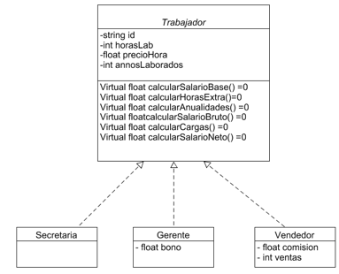

# Laboratorio #5 - Programación Orientada a Objetos (POO)

# Ejercicio Trabajador

- Implementar la siguiente clase

- El salario base corresponde a lo ganado por las 48 horas laborales.
- El salario bruto corresponde al pago de todas las horas laboradas incluyendo horas extra y  anualidades.
- En caso de los vendedores al salario bruto se le suma un porcentaje de comisión por las ventas realizadas.
- En caso del gerente al salario bruto se le suma un bono especial.
- Las horas extras tienen un valor de un 50% sobre las horas normales.
- Las cargas sociales son de un  9% sobre el sueldo bruto.
- El porcentaje por anualidad  es de un 5%  por cada año laborado y se calcula sobre el sueldo base.
- Implemente las siguientes colecciones polimórficas de trabajadores:
  - Colección tipo vector
  - Colección tipo lista